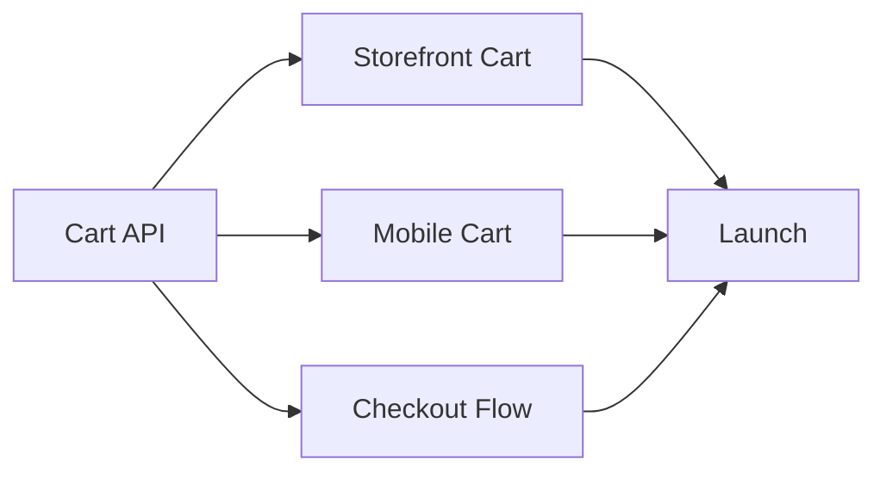

# Case Studies

Real-world examples of teams using spectryn successfully.

## Overview

These case studies showcase how different organizations use spectryn to improve their development workflows.

<div style="display: grid; grid-template-columns: repeat(auto-fit, minmax(300px, 1fr)); gap: 1.5rem; margin-top: 2rem;">

<div style="border: 1px solid var(--vp-c-divider); border-radius: 12px; padding: 1.5rem;">
<h3 style="margin-top: 0;">🏢 FinTech Startup</h3>
<p style="opacity: 0.8;">50-person engineering team migrated from scattered Notion docs to unified markdown specs</p>
<strong>Results:</strong> 40% faster sprint planning
</div>

<div style="border: 1px solid var(--vp-c-divider); border-radius: 12px; padding: 1.5rem;">
<h3 style="margin-top: 0;">🛒 E-commerce Platform</h3>
<p style="opacity: 0.8;">Multi-team coordination across 5 squads using shared epic templates</p>
<strong>Results:</strong> Zero story duplication
</div>

<div style="border: 1px solid var(--vp-c-divider); border-radius: 12px; padding: 1.5rem;">
<h3 style="margin-top: 0;">🏥 Healthcare SaaS</h3>
<p style="opacity: 0.8;">Compliance-focused team uses spectryn for audit trails and traceability</p>
<strong>Results:</strong> Audit-ready documentation
</div>

</div>

---

## Case Study 1: FinTech Startup

### Company Profile

| Attribute | Value |
|-----------|-------|
| **Industry** | Financial Technology |
| **Team Size** | 50 engineers, 8 squads |
| **Tracker** | Jira Cloud |
| **Challenge** | Scattered documentation, slow planning |

### The Challenge

Before spectryn, the team faced:
- Product specs in Notion, Confluence, and Google Docs
- Stories manually copied to Jira (error-prone)
- Sprint planning took 2+ hours
- No version history for requirements changes
- Difficult to review story changes in PRs

### The Solution

The team adopted spectryn with this workflow:

```
┌─────────────┐     ┌─────────────┐     ┌─────────────┐
│   Product   │     │  Engineers  │     │    Jira     │
│   writes    │────▶│   review    │────▶│   synced    │
│  markdown   │     │   in PR     │     │ automatically│
└─────────────┘     └─────────────┘     └─────────────┘
```

**Implementation:**

1. Created epic templates in `/docs/epics/`
2. Configured CI/CD to validate on PR
3. Auto-sync to Jira on merge to main
4. Used AI features for story refinement

### Configuration

```yaml
# spectryn.yaml
tracker: jira
version: 1

jira:
  url: ${JIRA_URL}
  project: FINTECH

validation:
  require_acceptance_criteria: true
  require_story_points: true
  max_story_points: 8  # Force splitting large stories

performance:
  parallel_sync: true
  max_workers: 4
```

### Results

| Metric | Before | After | Improvement |
|--------|--------|-------|-------------|
| Sprint planning time | 2.5 hours | 1.5 hours | **40% faster** |
| Stories with AC | 60% | 100% | **100% compliance** |
| Duplicate stories | 5-10/sprint | 0 | **Eliminated** |
| Time to sync | Manual (30min) | Automatic (2min) | **93% faster** |

### Key Learnings

::: tip What Worked Well
- **PR reviews for stories** caught ambiguous requirements early
- **AI story refinement** improved acceptance criteria quality
- **Automatic sync** eliminated manual data entry errors
:::

::: warning Challenges Overcome
- Initial resistance from PMs comfortable with Notion
- Training needed for markdown formatting
- Had to standardize story templates across teams
:::

---

## Case Study 2: E-commerce Platform

### Company Profile

| Attribute | Value |
|-----------|-------|
| **Industry** | E-commerce |
| **Team Size** | 120 engineers, 5 squads |
| **Trackers** | GitHub Issues + Linear |
| **Challenge** | Cross-team coordination |

### The Challenge

Five squads working on interconnected features:
- **Storefront** (React frontend)
- **Checkout** (Payment processing)
- **Inventory** (Warehouse integration)
- **Search** (Elasticsearch)
- **Mobile** (React Native)

Problems:
- Dependencies between squads hard to track
- Different teams used different issue formats
- No visibility into cross-team work
- Blocked stories discovered late

### The Solution

**Centralized epic repository:**

```
product-specs/
├── epics/
│   ├── storefront/
│   │   └── product-page-redesign.md
│   ├── checkout/
│   │   └── apple-pay-integration.md
│   ├── shared/
│   │   └── unified-cart.md      # Cross-team epic
│   └── templates/
│       └── cross-team-epic.md
├── spectryn.yaml
└── .github/
    └── workflows/
        └── sync-stories.yml
```

**Cross-team epic template:**

```markdown
# 🛒 Unified Cart Experience

> **Epic: Consistent cart across all platforms**

---

## Epic Summary

| Field | Value |
|-------|-------|
| **Teams** | Storefront, Checkout, Mobile |
| **Status** | 🔄 In Progress |
| **Priority** | 🔴 Critical |

### Dependencies



---

## Storefront Squad Stories

### 🎨 US-SF-001: Web Cart UI

| Field | Value |
|-------|-------|
| **Team** | Storefront |
| **Depends On** | US-API-001 |
| **Blocks** | US-CHK-001 |
```

### Multi-Tracker Sync

```yaml
# spectryn.yaml
version: 1

trackers:
  github:
    repo: company/storefront
    labels_from_team: true

  linear:
    team_key: MOBILE

sync:
  strategy: multi
  map_teams:
    storefront: github
    checkout: github
    mobile: linear
```

### Results

| Metric | Before | After | Improvement |
|--------|--------|-------|-------------|
| Cross-team visibility | Poor | Excellent | **Qualitative** |
| Blocked story discovery | At standup | In PR | **Days earlier** |
| Story format consistency | 50% | 100% | **Standardized** |
| Dependency tracking | Manual | Automatic | **Automated** |

### Key Learnings

::: tip What Worked Well
- **Shared epic templates** ensured consistency
- **Dependency visualization** in markdown (Mermaid)
- **Multi-tracker sync** allowed teams to use preferred tools
- **Cross-team PR reviews** improved coordination
:::

---

## Case Study 3: Healthcare SaaS

### Company Profile

| Attribute | Value |
|-----------|-------|
| **Industry** | Healthcare Technology |
| **Team Size** | 30 engineers |
| **Tracker** | Jira Server (on-premise) |
| **Challenge** | HIPAA compliance, audit requirements |

### The Challenge

As a healthcare company, they needed:
- Complete audit trail of all requirement changes
- Traceability from requirement to implementation
- Evidence for compliance audits
- Rollback capability for any change

### The Solution

**Git-based audit trail:**

```
┌────────────────────────────────────────────────────────────┐
│                    Audit Trail Flow                        │
├────────────────────────────────────────────────────────────┤
│                                                            │
│  Requirement    PR Review     Git Commit     Jira Sync     │
│   Change    →   Approval  →   History    →   Audit Log    │
│                                                            │
│  WHO: Author    WHO: Reviewer  WHEN: Timestamp WHAT: Changes│
│  WHAT: Diff     WHY: Comments                              │
│                                                            │
└────────────────────────────────────────────────────────────┘
```

**Compliance configuration:**

```yaml
# spectryn.yaml
tracker: jira
version: 1

jira:
  url: ${JIRA_URL}
  project: HIPAA

compliance:
  require_approval: true
  audit_log: true
  backup_before_sync: true

validation:
  require_acceptance_criteria: true
  require_description: true
  min_description_length: 50  # Detailed requirements

hooks:
  pre_sync:
    - validate_approval
    - create_backup
  post_sync:
    - log_audit_event
    - notify_compliance_team
```

**Story template with compliance fields:**

```markdown
### 🏥 US-001: Patient Data Encryption

| Field | Value |
|-------|-------|
| **Story Points** | 8 |
| **Priority** | 🔴 Critical |
| **Status** | 📋 To Do |
| **Compliance** | HIPAA §164.312(a)(1) |
| **Risk Level** | High |
| **Approved By** | @security-team |

#### Description

**As a** system administrator
**I want** all patient data encrypted at rest
**So that** we comply with HIPAA requirements

#### Regulatory Reference

- HIPAA Security Rule §164.312(a)(1)
- Technical safeguard: Encryption
- Risk assessment: RA-2024-001

#### Acceptance Criteria

- [ ] AES-256 encryption for all PHI fields
- [ ] Key rotation every 90 days
- [ ] Encryption verified in security audit
- [ ] Compliance report generated
```

### Audit Report Generation

```bash
# Generate compliance report
spectryn report --format compliance --output audit-report.pdf

# Show change history for specific story
spectryn history --story US-001 --format detailed

# Export for auditors
spectryn export --format csv --include-history --output audit-export.csv
```

### Results

| Metric | Before | After | Improvement |
|--------|--------|-------|-------------|
| Audit preparation | 2 weeks | 2 days | **85% faster** |
| Requirement traceability | Manual | Automatic | **100% coverage** |
| Change documentation | Inconsistent | Complete | **Audit-ready** |
| Compliance findings | 3-5/audit | 0 | **Zero findings** |

### Key Learnings

::: tip What Worked Well
- **Git history** provides immutable audit trail
- **PR approvals** document review process
- **Automated backups** enable point-in-time recovery
- **Compliance fields** in template ensure consistency
:::

---

## Implementation Recommendations

Based on these case studies, here are universal recommendations:

### 1. Start Small

```bash
# Begin with one team/epic
spectryn sync --markdown epics/pilot-project.md

# Expand after proving value
```

### 2. Standardize Templates

Create templates that match your workflow:
- Sprint story template
- Bug report template
- Technical debt template
- Cross-team epic template

### 3. Integrate with CI/CD

```yaml
# Validate on every PR
- name: Validate Stories
  run: spectryn --validate --markdown epics/

# Sync on merge to main
- name: Sync Stories
  if: github.ref == 'refs/heads/main'
  run: spectryn sync --execute
```

### 4. Train Your Team

- Workshop on markdown format
- Document your conventions
- Create a CONTRIBUTING.md for story writing

### 5. Measure Success

Track metrics before and after:
- Sprint planning time
- Story quality (AC coverage)
- Time from requirement to Jira
- Duplicate/inconsistent stories

---

## Share Your Story

Using spectryn successfully? We'd love to feature your case study!

- Open a [discussion](https://github.com/adriandarian/spectryn/discussions)
- Tweet us [@spectryn_cli](https://twitter.com/spectryn_cli)
- Email: case-studies@spectryn.dev
