# Getting Started

spectra is a production-grade CLI tool for synchronizing markdown documentation with issue trackers. Write your epic docs in markdown, sync to your favorite tracker automatically.

## Supported Trackers

spectra supports **14 issue trackers** out of the box:

| Tracker | Type | Best For |
|---------|------|----------|
| [**Jira**](/guide/configuration#jira) | Enterprise | Large teams, complex workflows |
| [**GitHub Issues**](/guide/configuration#github) | Developer | Open source, code-centric teams |
| [**GitLab Issues**](/guide/gitlab) | DevOps | GitLab-native projects |
| [**Azure DevOps**](/guide/configuration#azure-devops) | Enterprise | Microsoft ecosystem |
| [**Linear**](/guide/configuration#linear) | Startup | Fast-paced product teams |
| [**Asana**](/guide/configuration#asana) | Collaboration | Cross-functional teams |
| [**Trello**](/guide/trello) | Visual | Kanban workflows |
| [**ClickUp**](/guide/clickup) | All-in-one | Feature-rich needs |
| [**Shortcut**](/guide/shortcut) | Agile | Engineering teams |
| [**Monday.com**](/guide/monday) | Work OS | Marketing & operations |
| [**Plane**](/guide/plane) | Open source | Self-hosted preference |
| [**YouTrack**](/guide/youtrack) | JetBrains | IntelliJ users |
| [**Basecamp**](/guide/basecamp) | Simple | Small teams |
| [**Bitbucket**](/guide/bitbucket) | Atlassian | Bitbucket repos |
| **Pivotal Tracker** | Agile | Story-based planning |

## Why spectra?

Managing issues through web interfaces is slow and tedious. Developers prefer working with markdown files that can be:

- ✅ Version controlled with Git
- ✅ Reviewed in pull requests
- ✅ Edited with your favorite editor
- ✅ Generated with AI assistants

spectra bridges the gap between markdown-first documentation and project management.

## Key Features

| Feature | Description |
|---------|-------------|
| **Multi-Tracker Support** | 14 trackers with unified markdown format |
| **Full Epic Sync** | Sync stories, subtasks, descriptions, comments |
| **Smart Matching** | Fuzzy matching between markdown and tracker issues |
| **Safe by Default** | Dry-run mode, confirmations, previews |
| **Backup & Rollback** | Automatic backups before sync, easy rollback |
| **Plugin System** | Extensible architecture for custom adapters |

## How It Works

```mermaid
graph LR
    A[📝 Markdown File] --> B[spectra CLI]
    B --> C{Dry Run?}
    C -->|Yes| D[📊 Preview Changes]
    C -->|No| E[☁️ Tracker API]
    E --> F[✅ Issues Updated]
```



1. **Write** your epic documentation in markdown following the [schema](/guide/schema)
2. **Preview** changes with dry-run mode (default)
3. **Sync** to your tracker with `--execute` flag
4. **Verify** results in your tracker or with audit trail

## Quick Example

Create a markdown file with your epic:

```markdown
### 🚀 STORY-001: User Authentication

| Field | Value |
|-------|-------|
| **Story Points** | 5 |
| **Priority** | 🟡 High |
| **Status** | 📋 Planned |

#### Description

**As a** user
**I want** to authenticate securely
**So that** my data is protected

#### Subtasks

| # | Subtask | Description | SP | Status |
|---|---------|-------------|:--:|--------|
| 1 | Create login form | Build the login UI | 2 | 📋 Planned |
| 2 | Implement JWT auth | Add JWT token handling | 3 | 📋 Planned |
```

Sync to your tracker:

::: code-group

```bash [Jira]
spectra sync --tracker jira --markdown EPIC.md --epic PROJ-123 --execute
```

```bash [GitHub]
spectra sync --tracker github --markdown EPIC.md --repo owner/repo --execute
```

```bash [GitLab]
spectra sync --tracker gitlab --markdown EPIC.md --project mygroup/myproject --execute
```

```bash [Linear]
spectra sync --tracker linear --markdown EPIC.md --team TEAM --execute
```

```bash [Azure DevOps]
spectra sync --tracker azure --markdown EPIC.md --project MyProject --execute
```

:::

## Next Steps

<div class="vp-doc" style="display: grid; grid-template-columns: repeat(auto-fit, minmax(200px, 1fr)); gap: 1rem; margin-top: 1.5rem;">

<a href="/guide/installation" style="display: block; padding: 1rem; border: 1px solid var(--vp-c-divider); border-radius: 8px; text-decoration: none;">
<strong>📦 Installation</strong><br/>
<span style="opacity: 0.7">Install via pip, Homebrew, or Docker</span>
</a>

<a href="/guide/quick-start" style="display: block; padding: 1rem; border: 1px solid var(--vp-c-divider); border-radius: 8px; text-decoration: none;">
<strong>⚡ Quick Start</strong><br/>
<span style="opacity: 0.7">Your first sync in 5 minutes</span>
</a>

<a href="/guide/schema" style="display: block; padding: 1rem; border: 1px solid var(--vp-c-divider); border-radius: 8px; text-decoration: none;">
<strong>📐 Schema Reference</strong><br/>
<span style="opacity: 0.7">Complete markdown format guide</span>
</a>

<a href="/guide/ai-fix" style="display: block; padding: 1rem; border: 1px solid var(--vp-c-divider); border-radius: 8px; text-decoration: none;">
<strong>🤖 AI Fix</strong><br/>
<span style="opacity: 0.7">Fix formatting issues with AI assistance</span>
</a>

</div>

